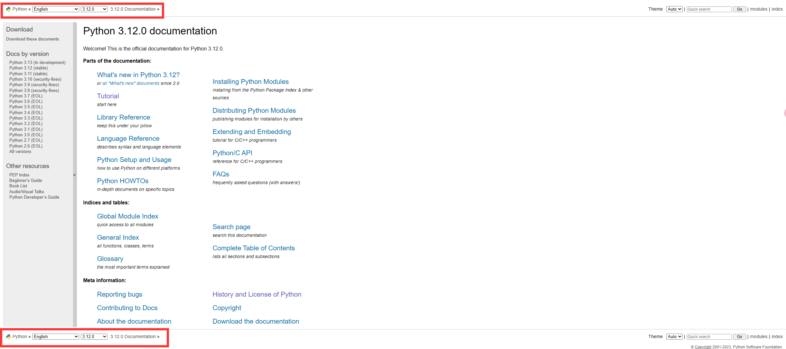
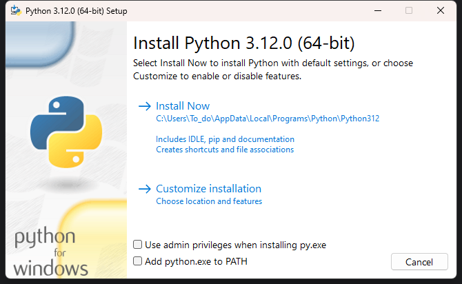
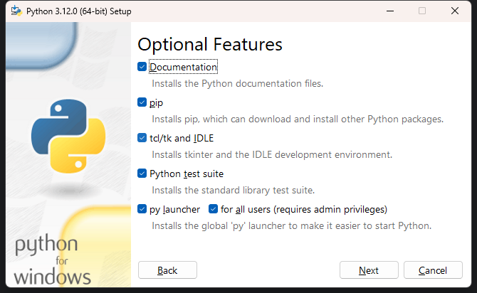

# 安装Python运行环境
---

---

## 官网路线
1. 打开官网：https://www.python.org/ 鼠标移动至Download上，点击下方的Python 3.xx.xx即可下载。<br />
   * 如果需要下载某一特定源代码：**[Downloads -> Windows](https://www.python.org/downloads/windows/)**.
   * 如果需要下载源代码供学习：**[Downloads -> Source Code](https://www.python.org/downloads/source/)**
   * 如果需要查阅文档（学习一门语言最快速深刻的方法）：**[Docs](https://docs.python.org/3/)**
     * 如果你需要查看某一特定版本的文档,可以在红框所示区域内选择版本号及语言(2.x可以统一查看2.6版本)<br />
2. 下载安装包，之后的示例中以[python-3.12.0-amd64.exe](..%2F..%2FPackages%2Fpython-3.12.0-amd64.exe)为例。
   1. 下载前可在**设置->系统->关于：系统类型条目中确定你的系统是“[64-bit operating system, x64-based processor](https://support.microsoft.com/zh-tw/windows/32-%E4%BD%8D%E5%85%83%E8%88%87-64-%E4%BD%8D%E5%85%83-windows-%E5%B8%B8%E8%A6%8B%E5%95%8F%E9%A1%8C%E9%9B%86-c6ca9541-8dce-4d48-0415-94a3faa2e13d)”**
      * **如果你的系统是32bit/x86的，建议你如果不是电脑实在过于过时或不兼容，请安装[64bit](https://msdn.itellyou.cn/)版本系统**
3. 在下载好地安装包处**右键->以管理员身份运行**（直接双击打开也可） <br />
   * Install Now ：以Python推荐的方式（包括IDLE, PIP和文档，创建文件关联及快捷方式）
   * Customize installation：自定义的安装内容 - **推荐**
   * Use admin privileges when installing py.exe：以管理员权限安装Python - **推荐**
   * Add python.exe to PATH：向PATH中添加Python项
     * [在 PATH 环境变量中设置命令路径，指定用于搜索可执行(.exe) 文件的目录集。 如果在不使用参数的情况下使用，此命令将显示当前命令路径。](https://learn.microsoft.com/zh-cn/windows-server/administration/windows-commands/path)<br />另：请新手通过**设置->系统->关于->高级系统设置->环境变量**设置，`谨防清空PATH`
4. 点击自定义安装后，**建议全选**，下面是各个选项的简介。官网可以看到更详细的解释。<br />
   * Documentation：Python相关的文档，脱机可查看。推荐安装，随时查阅。（脱离IDE环境）
   * PIP：Package Installer for Python，可以使用PIP快捷安装[PYPI(Python Package Index)](https://pypi.org/)内的包。
     * 例如：pip install nvitop -> 则会安装 [nvitop](https://pypi.org/project/nvitop/) Package
     * 反过来同理可得：我从某个地方听到了一个好用的包叫Numpy，那么我可以去PYPI搜索Numpy，而后得到pip install numpy这条指令，下载即可使用这个包。
   * td/tk and IDLE：
   ```markdown
   IDE - Integrated Development Environment  集成式开发环境
   IDLE - Integrated Development and Learning Environment 集成式开发学习环境
   td - Turtle Demo ： 一些有趣的海龟绘图小[Demo](https://zh.wikipedia.org/zh-tw/Demo)。是抖音营销号最喜欢的糊弄外行的玩具。
   TCL/TK - TK 就是Tkinter：Python自带的GUI（用户图形界面）编程库/包，TCL则是一种脚本语言，主要用于自动化测试。
   ```
   仅代表个人看法：IDLE其实在某些方面非常适合**什么都不懂**的连Office都没怎么用过的**真正的初学者**，因为IDLE免安装免配置功能少学习成本低且概念互通易于迁移。
   * Python test suite：进行单元测试所用的包，用以制作测试用例
   ```Python
   import unittest
   ```
   * Py launcher 和 For all users： Python
5. 之后可以点击安装（推荐为所有用户安装）<br />
6. 之后等待安装完成即可。
---
### 验证安装
1. 使用 `Win + R` 组合键调出运行
2. 输入 `cmd` 运行 **Command Prompt**
3. 输入 `python` 或 `py` 后回车，如果出现<br />`Python 3.10.11 (tags/v3.10.11:7d4cc5a, Apr  5 2023, 00:38:17) [MSC v.1929 64 bit (AMD64)] on win32
   `<br />`Type "help", "copyright", "credits" or "license" for more information.`<br />则意味着安装成功
4. [Error] 如果提示`'python' is not recognized as an internal or external command, operable program or batch file.`，<br />可以尝试输入`[Environment]::SetEnvironmentVariable("Path", "$env:Path;<Python Install Location>", "User")`<br />例如：`[Environment]::SetEnvironmentVariable("Path", "$env:Path;C:\Python27", "User")`
   * 特别提示：CMD中复制为选中后右键，粘贴为复制后在对话框中右键
---
//TO-DO：Windows Store 下载方式